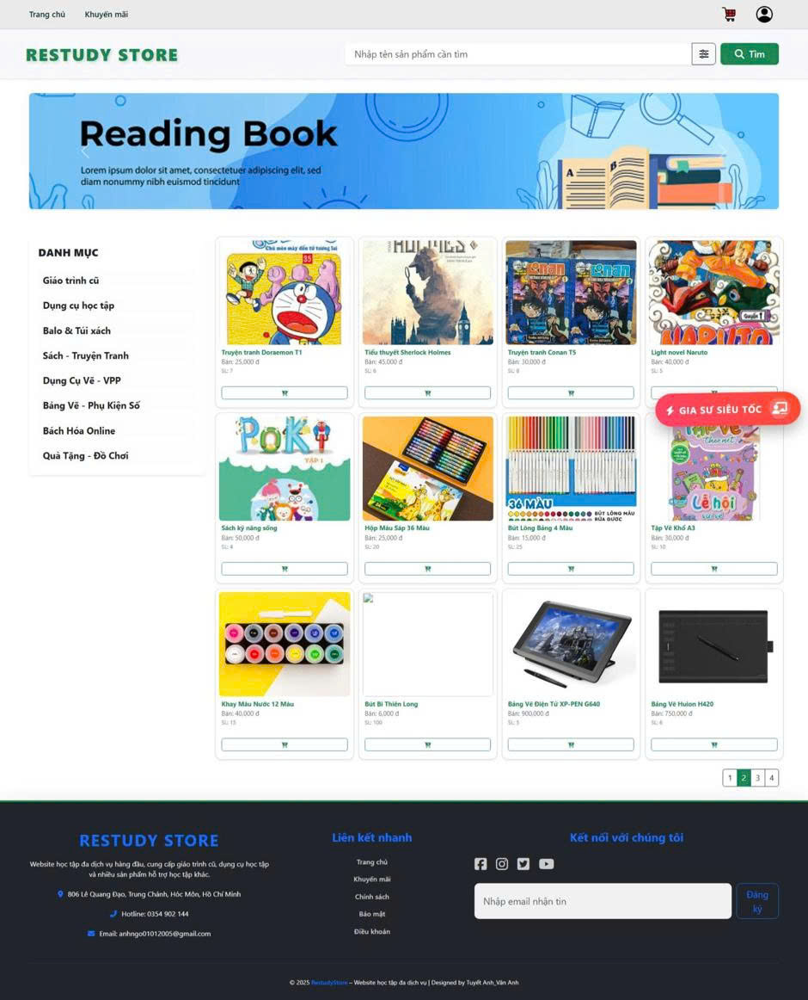
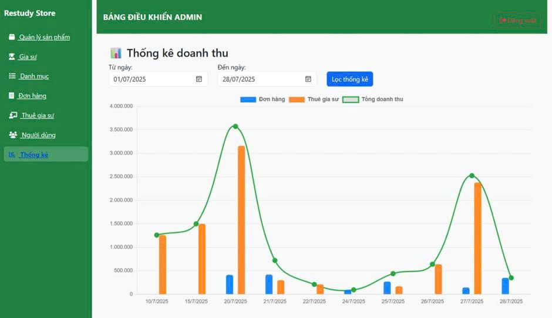
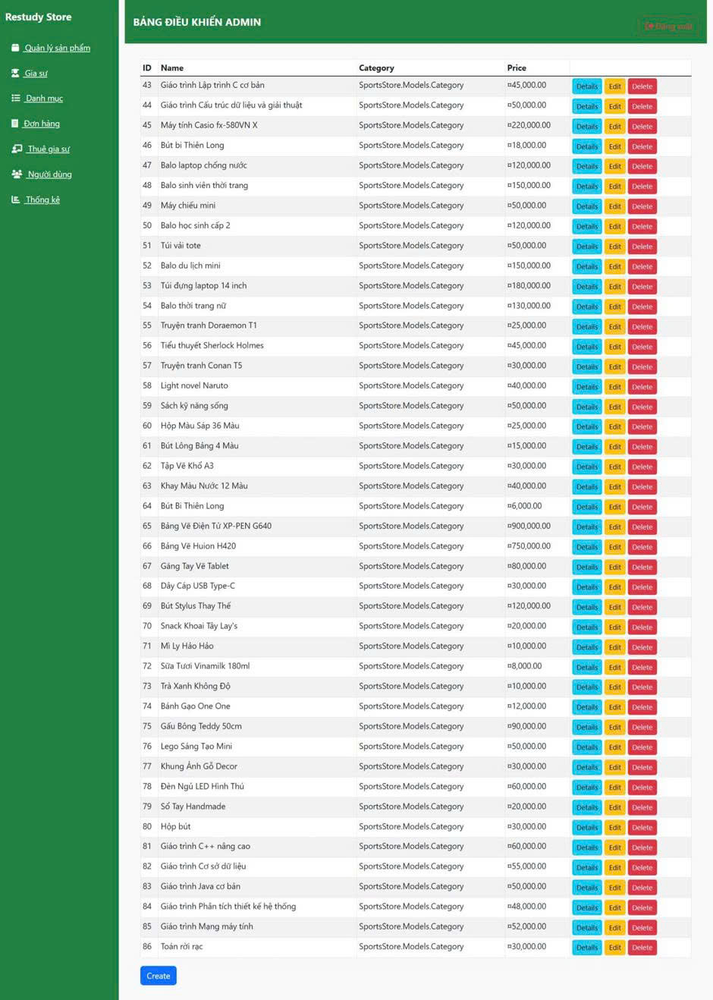
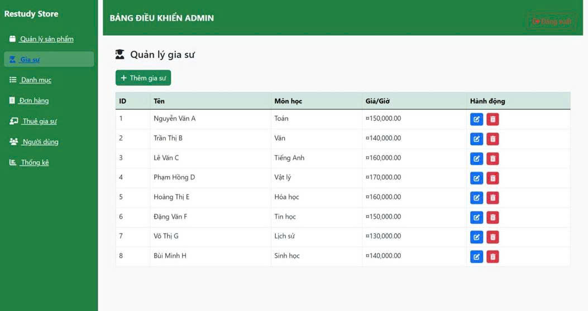
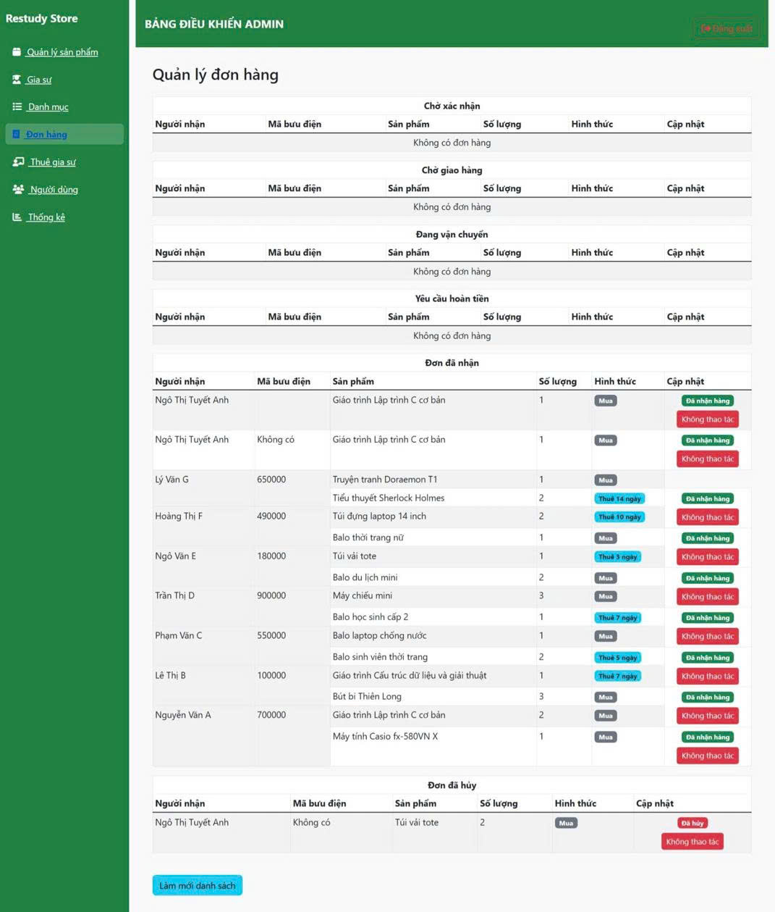
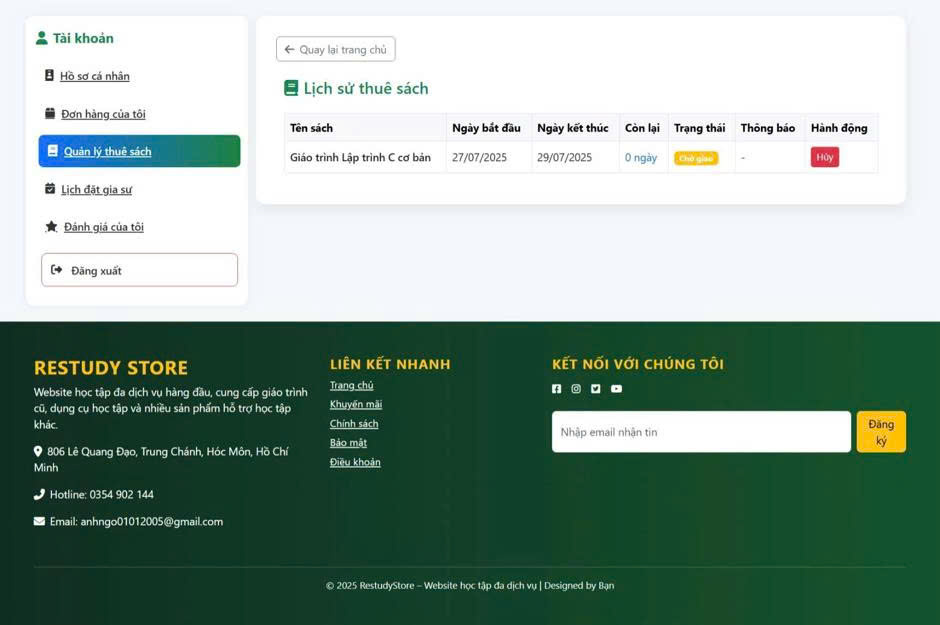

<div align="center">

# Used Books & Tutor Platform

A web application for buying and renting used books, combined with tutor search and rental features. Developed to practice building a database-driven web system with practical business workflows.

[](https://learn.microsoft.com/en-us/dotnet/csharp/)
[](https://dotnet.microsoft.com/apps/aspnet)
[](https://learn.microsoft.com/en-us/ef/core/)
[](https://www.microsoft.com/sql-server)

[View Repository](https://github.com/TuyetAnh0101/Website) • [Report Bug](https://github.com/TuyetAnh0101/Website/issues)

</div>

---

## Overview

The platform supports the buying, selling, and renting of used books, while also providing features for searching and renting tutors. The project focuses on developing a practical web application with a relational database and common business operations such as account management, shopping, order processing, reviews, and user authorization.

---

## Application Preview

| Home Page | Statistics & Dashboard |
| :---: | :---: |
|  |  |
| **Product Management** | **Tutor Management** |
|  |  |
| **Order Management** | **Rental History** |
|  |  |

---

## Tech Stack & Architecture

### Technologies

| Category | Technology |
|---|---|
| **Backend** | C#, ASP.NET Core |
| **ORM** | Entity Framework Core |
| **Database** | SQL Server |
| **Authentication** | ASP.NET Core Identity |
| **Frontend** | HTML, CSS, JavaScript |
| **Web Framework** | Razor Pages, MVC, Blazor |

### Architecture Flow

`Web Interface (ASP.NET Core)` ➔ `Application Layer (Controllers/Services)` ➔ `Data Access (EF Core)` ➔ `Database (SQL Server)`

---

## Main Features

- **Used Books Management:** Buy, sell, and rent used books through the platform.
- **Tutor Services:** Search for tutors and manage tutor rental services.
- **Shopping & Orders:** Add books to the cart, manage selected items, and process customer orders.
- **User Authentication:** Secure user registration, login, and account management using ASP.NET Core Identity.
- **Interactive Reviews:** Allow users to provide ratings and reviews for products and services.
- **Data Handling:** Robust relational database management utilizing Entity Framework Core.

---

## Getting Started

### Prerequisites

- **.NET SDK:** Version 9.0
- **Database:** SQL Server
- **IDE:** Visual Studio 2022 (or later)

### Installation & Setup

**1. Clone the repository**
```bash
git clone [https://github.com/TuyetAnh0101/Website.git](https://github.com/TuyetAnh0101/Website.git)
cd Website
